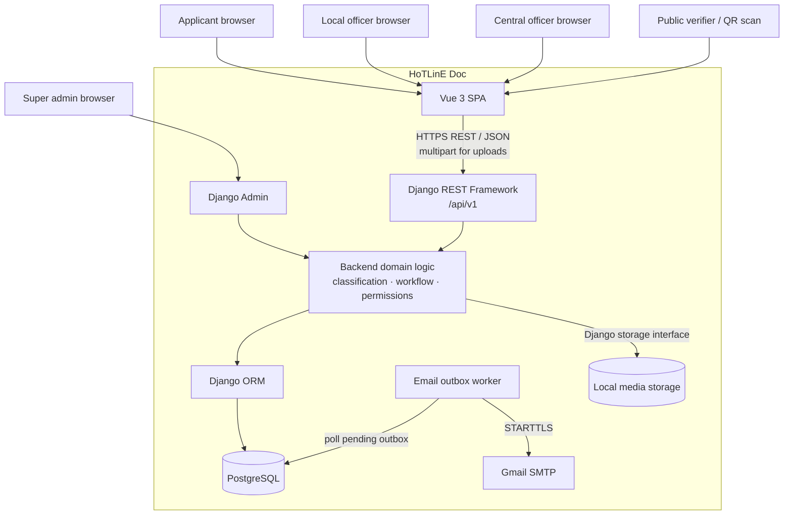
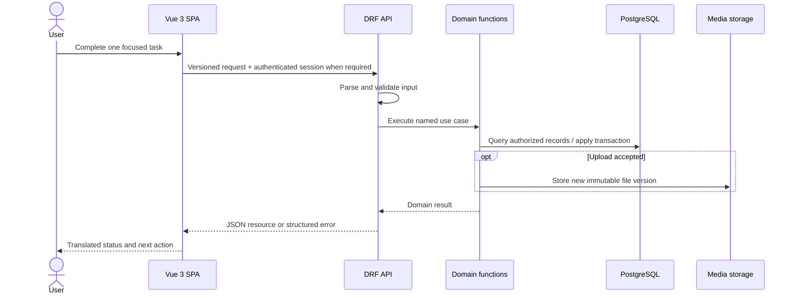
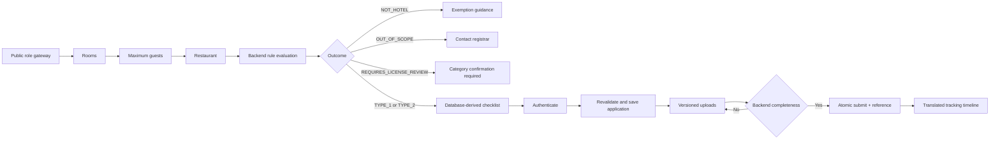
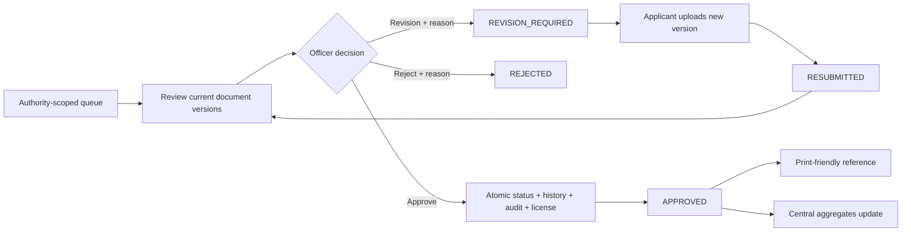
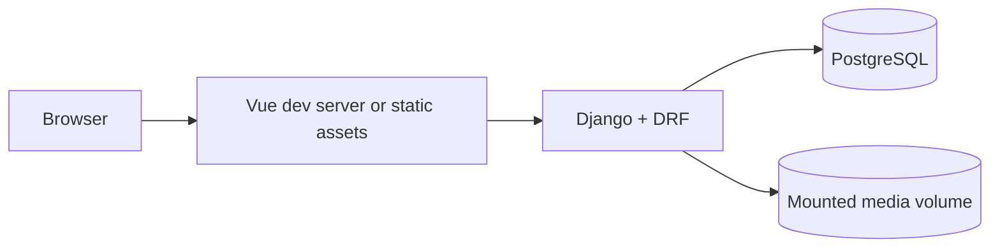

# System Overview

## Architectural Goal

HoTLinE Doc is a simple monorepo web application optimized for a reliable Hackathon demonstration. It uses one Vue single-page application, one Django/DRF backend, one PostgreSQL database, and local Django media storage. Business rules and authorization stay on the backend; the frontend presents guided interaction.

This is a modular monolith, not a distributed system. The boundary between browser and server is a versioned REST/JSON API under `/api/v1/`.

## Context Diagram

For local development, HTTPS may be replaced by HTTP on loopback. A production deployment would terminate TLS before the application.

## Runtime Request Path

The API never accepts client authority over owner IDs, officer scope, reference numbers, audit actors/times, fees, or arbitrary application status values.

## Component Responsibilities

### Vue 3 SPA

The frontend owns:

- semantic presentation and responsive page composition;
- the three-step wizard interaction and temporary anonymous progress;
- input affordances and client-side validation feedback;
- calling the documented API and rendering structured errors;
- route-level user journeys for applicant, local officer, and central officer;
- Pinia state only where state crosses views or the login boundary;
- `vue-i18n` UI translations for Thai and English; and
- accessible status, progress, focus, and correction experiences.

The frontend does **not** own:

- classification decisions;
- checklist definitions;
- fee selection;
- permission decisions;
- status transition policy;
- reference/license generation; or
- audit identity and timestamps.

Prefer focused Vue components and semantic HTML. Add a composable only when logic is genuinely reused or a view becomes difficult to understand.

### Django and Django REST Framework

The backend owns:

- demo authentication and role-based authorization;
- applicant ownership and `LocalAuthority` scoping;
- database-driven classification evaluation;
- master-data localization/fallback;
- checklist derivation and submission readiness;
- upload validation and document versioning;
- synchronous advisory image-quality and bounded local document-family OCR preflight attached to each uploaded version;
- the centrally defined application state machine;
- document review and correction rules;
- de-identified completed-case search and database-managed bilingual officer FAQs;
- backend-generated references, fees, and licenses;
- opaque-token public licence verification and server-generated QR images with an allow-listed response;
- transactions, status history, and immutable audit records;
- aggregate central reporting; and
- applicant registration, signed email activation, transactional email outbox creation; and
- Django Admin for Super Admin/master-data work.

Use DRF serializers for transport validation and representation. Put multi-record invariants or important transitions in small named domain/service functions with `transaction.atomic()`. Do not create a mandatory service/repository wrapper for routine CRUD.

### PostgreSQL

PostgreSQL stores:

- users, roles, and authority assignments;
- properties, applications, classifications, and current statuses;
- normalized master data and translation rows;
- requirements, document metadata, version-bound quality preflight, and review history;
- fee schedules, issued-license snapshots, and opaque public verification tokens;
- application status history and audit entries; and
- email verification time and idempotent email delivery attempts; and
- constraints that reinforce uniqueness and referential integrity.

### Email outbox worker

The worker is a second process from the same Django image, not a separate service architecture or external queue. Workflow transactions insert one `EmailOutbox` row per event/recipient. An `on_commit` attempt provides prompt delivery; the polling worker retries due rows with bounded exponential backoff. It renders activation tokens and message bodies only at send time, records only a redacted exception class, and never changes application status when delivery fails.

See `docs/database/erd.md` and `docs/database/normalization.md` for the logical data model.

### Uploaded Files

For the MVP, file bytes use Django's local/media storage while PostgreSQL stores metadata and references. All access goes through backend authorization; a predictable public media URL must not bypass ownership/authority checks.

Code interacts through Django's storage abstraction so object storage can replace the backend later without redesigning document/application models. Cloud storage, virus-scanning infrastructure, signed URLs, and lifecycle automation are deliberately deferred.

## Logical Backend Modules

The exact Django app split may be kept small. A reasonable starting boundary is:

| Module | Responsibility |
| --- | --- |
| `accounts` | Custom user/role, authentication, authority assignment |
| `master_data` | Authorities, types/translations, rules, agencies/translations, fees |
| `applications` | Properties, applications, classification, workflow, history, central aggregates |
| `documents` | Document types/translations, requirements, uploads, versions, reviews |
| `licenses` | Approval-time issuance and printable representation; may remain inside `applications` if smaller |
| `audit` | Append-only audit entry helper/model; may remain inside `applications` for MVP |

This is guidance, not a requirement to create an app per table. If `licenses` or `audit` would contain only one small model/helper, keeping them with `applications` is simpler.

## Key End-to-end Flows

### Applicant classification to submission

Anonymous wizard progress is convenience state, not trusted classification data. After login, the server revalidates the answers and creates the owned application from its own evaluation.

### Review, revision, and approval

Each mutation rechecks actor scope and allowed source status at execution time. Frontend route state is never sufficient proof.

## API Shape

- Resource-oriented endpoints live under `/api/v1/`.
- JSON is the default representation; document upload uses multipart form data.
- Session authentication is the simplest demo option when SPA and backend share an origin or trusted development arrangement. The security document may select another standard Django-compatible mechanism if justified.
- Errors use a stable structure with a machine code, translated/display-safe message strategy, and field errors where applicable.
- Named endpoints such as `/submit/`, `/request-revision/`, and `/approve/` express domain actions rather than permitting arbitrary status patches.
- OpenAPI through drf-spectacular is preferred if it remains a small dependency; `docs/api/api-contract.md` stays the human-readable contract.

## Transaction Boundaries and Concurrency

Use a database transaction and, where needed, row locking or uniqueness constraints for:

- selecting/incrementing a document version and changing `is_current`;
- first submission and reference generation;
- each application transition plus status history/audit;
- final approval plus license creation and fee snapshot; and
- any update that could otherwise leave two current versions or duplicate licenses.

Database constraints are a backstop, not a substitute for readable domain validation. Duplicate/retried actions should return the existing result or a clear conflict without duplicating history.

## Localization

- Vue UI copy uses locale JSON files (`th`, `en`).
- Translatable master data uses normalized translation tables.
- API serialization uses requested locale, then Thai, then a stable code fallback.
- Stable codes remain untranslated identifiers; only labels/descriptions are localized.
- Adding `my` or `zh` later requires content rows/files, not new language columns.

## Security Boundaries

- Authentication identifies the actor; backend authorization filters every protected resource.
- Applicants are owner-scoped, officers authority-scoped, central officers aggregate-read-only, and Super Admin uses Django Admin.
- Uploads receive defense-in-depth validation and are served through authorized backend access for the MVP.
- Secrets come from environment variables and no real PII belongs in demo data.
- Audit actor and timestamps are server-derived.
- Browser hiding, route guards, and user-supplied IDs never grant access.

## Local Development and Deployment Shape

Docker Compose should provide PostgreSQL and, when straightforward, backend and frontend services. The deployed MVP remains the same three runtime responsibilities:

No Redis, queue worker, event bus, or Kubernetes control plane is required.

## Evolution Seams, Not Implemented Features

- External identity: isolate login/user provisioning so a ThaiID adapter can be added later.
- Object storage: retain Django's storage interface.
- Additional languages: add locale files and translation rows.
- Notifications: consume explicit domain events later, without adding a broker now.
- Official rules/checklists: change versioned master data and tests after policy validation.

These seams must not become speculative frameworks during the MVP.
