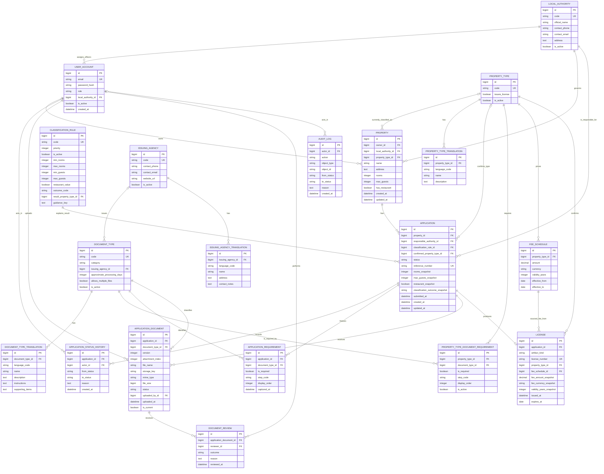

# Entity-relationship Model

## Scope

This is the target logical schema for the HoTLinE Doc MVP. It keeps changing master data normalized, preserves document/status history, and stores only the snapshots needed to reproduce submitted and approved decisions. Django migration/model names may use conventional casing, but domain names, relationships, and constraints must remain aligned with this document.

## Mermaid ER Diagram

Nullable FKs are marked by their relationships even though Mermaid's attribute list does not express nullability. In particular, `USER_ACCOUNT.local_authority_id` is required only for local officers; classification/property-type FKs are nullable for exemption, out-of-scope, and unresolved results; and an audit actor may be null only for a clearly identified system action.

## Core Design Decisions

### User roles without a role table

The MVP has four stable role codes: `APPLICANT`, `LOCAL_OFFICER`, `CENTRAL_OFFICER`, and `SUPER_ADMIN`. A constrained role field on a custom Django user is simpler than a role/permission graph. Django permissions still protect Admin operations. `local_authority_id` is required for an active local officer and must be null for roles that are not authority-scoped.

### Authority is retained on the application

`Property.local_authority_id` is the current property relationship. `Application.responsible_authority_id` is the routing snapshot used for authorization after submission. This intentional duplication prevents a later property edit from silently moving an in-flight application. Any administrative correction is audited.

### Classification is data-driven and explainable

`ClassificationRule` holds simple bounded conditions, priority, outcome, and an optional resulting property type. `REQUIRES_LICENSE_REVIEW` has no `result_property_type_id`. The application stores the selected rule plus the three input values and outcome snapshot so a later rule edit does not rewrite history.

This is not a generic expression language. The small evaluator understands the documented room/guest/restaurant columns and rejects ambiguous active configuration.

### Requirements use two relationship tables

`PropertyTypeDocumentRequirement` is editable master data. `ApplicationRequirement` is the application's captured checklist. It is created from active type requirements when an authenticated application with a confirmed type is established (and may be refreshed while still an untouched draft under one documented rule). It snapshots the preparation `step_code` together with required/order fields. Once submitted, it is fixed. This prevents a later Admin edit from adding, removing, or regrouping documents on an in-flight application without an audit trail.

`APPLICATION_REQUIREMENT` is the one entity beyond the brief's suggested list that directly protects historical correctness. It stores relationships and ordering, not copied document names or instructions.

### Document bytes and metadata are separate

File bytes live in configured Django storage. `ApplicationDocument` stores the opaque storage key plus validation/display metadata. Files selected together share a monotonically increasing bundle version and use `attachment_index` for their position in that bundle. Reviews target one exact attachment/version; replacement retains all prior bundle attachments.

### Translations are rows, not language columns

Property types, document types, and issuing agencies use child translation tables. Each table has a unique parent/language pair. Local authorities retain their statutory `official_name` for the MVP; if user-authored localized names become authoritative later, add a `LocalAuthorityTranslation` table using the same pattern rather than `name_en`, `name_my`, and similar columns.

### Fees are effective-dated and licenses snapshot them

Schedules are append-only/effective-dated master data. `License.artifact_kind` distinguishes a fee-bearing hotel licence from a non-hotel notification acknowledgement. A hotel licence keeps the schedule FK for provenance and amount/currency/validity snapshots for historical reproduction. Those fields and expiry are null for an acknowledgement. The property type FK records the confirmed processing type at issuance. The application-to-artifact relationship is zero-or-one.

### Audit is generic but deliberately small

`AuditLog.object_type` and `object_id` can refer to several workflow objects without creating one nullable FK per model. This controlled generic reference is appropriate for an append-only cross-cutting log. Domain tables retain their own strongly typed relationships for all functional behavior; no workflow query depends on the generic audit reference.

## Required Constraints and Indexes

Implement these database protections where supported, with matching application validation:

| Table | Constraint/index |
| --- | --- |
| `UserAccount` | unique normalized email; index `(role, local_authority_id)` |
| `PropertyTypeTranslation` | unique `(property_type_id, language_code)` |
| `DocumentTypeTranslation` | unique `(document_type_id, language_code)` |
| `IssuingAgencyTranslation` | unique `(issuing_agency_id, language_code)` |
| `ClassificationRule` | unique code; unique or validated active priority; nonnegative bounds and minimum ≤ maximum |
| `PropertyTypeDocumentRequirement` | unique `(property_type_id, document_type_id)` |
| `ApplicationRequirement` | unique `(application_id, document_type_id)` |
| `Application` | unique nullable reference number; indexes `(property_id, status)` and `(responsible_authority_id, status)` |
| `ApplicationDocument` | unique `(application_id, document_type_id, version, attachment_index)`; conditional unique current row per `(application_id, document_type_id, attachment_index)`; positive version/attachment index/file size |
| `FeeSchedule` | amount ≥ 0, validity years > 0, end ≥ start; prevent overlapping active periods for a property type/currency in validation/constraint |
| `License` | unique application; unique artifact number; hotel licence requires fee/validity/expiry while notification acknowledgement requires those fields to be null |
| Histories/audit | indexes by parent/object and descending `created_at`; no product update/delete endpoint |

Add indexes in response to actual list/filter paths, not speculatively. The authority/status and application/document paths above are known MVP queries.

## Deletion Policy

- Use `PROTECT` for master rows referenced by submitted applications, documents, fee schedules, or licenses.
- Prefer `is_active = false` over deletion for rules, types, agencies, authorities, and requirements.
- Never cascade-delete audit, status history, reviewed document versions, or an issued license through ordinary product behavior.
- Draft-only records may be deleted only if the product explicitly adds that flow; it is not required for the MVP.
- File cleanup must never remove historical document bytes still referenced by a version row.

## Transaction Boundaries

The following operations must be atomic:

- capture an application's requirements;
- allocate a document version and switch the current marker;
- submit and allocate a reference plus status history/audit;
- request revision or resubmit plus history/audit; and
- approve plus status/history/audit/license creation and fee snapshot.

Uniqueness constraints make retries/concurrency safe; domain functions turn resulting conflicts into clear API errors or idempotent responses.
